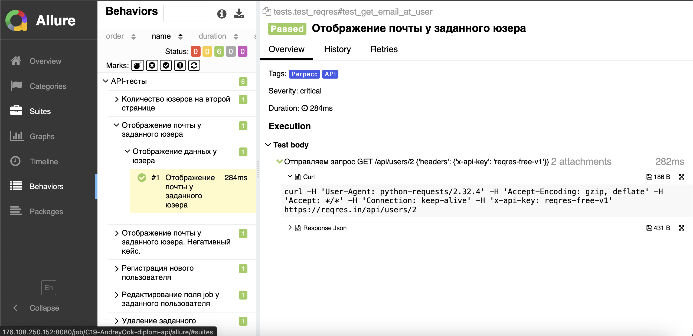

# Пример проекта автотестов для сайта  [reqres.in]((https://reqres.in/))


###  Используемые технологии
<p align="center">
  <code></code>
  <code></code>
  <code></code>
  <code></code>
  <code></code>
  <code></code>
  <code></code>
  <code></code>
   <code></code>
</p>

## Покрываемый функционал

- [x] Отображение списка пользователей;
- [x] Отображение данных у пользователя;
- [x] Отображение почты пользователя;
- [x] Регистрация нового пользователя;
- [x] Редактирование поля job у пользователя;
- [x] Удаление заданного пользователя; 
  
## Запуск тестов
Процесс автоматизации тестирования организован с использованием Jenkins, размещённого в докер-контейнере. Контейнеризация Jenkins выполняется посредством Docker. Сам контейнер с Jenkins запущен на виртуальной машине (VM), предоставленной сервисом облачных вычислений Cloud.ru.


Для запуска тестов локально, нужно выполнить следующие шаги
1. Склонировать репозиторий
2. Открыть проект в PyCharm
3. Ввести в териминале следующие команды
``` 
source .venv/bin/activate
pip install -r requirements.txt
pytest
```

### С помощью Jenkins
#### Для запуска автотестов необходимо:
 - Открыть джобу в jenkins
 - Нажать на кнопку Build with Parameters
 - Выбрать окружение, где будут исполняться тесты (заглушка)
 - Нажать на Build


## Отчет о прохождении тестов (Allure)
### Локально
Для получения отчета нужно ввести команду 
```
allure serve tests/allure-results
``` 
Ниже представлен пример allure отчета 


Подробные инструкции по работе с allure можно найти по [ссылке](https://allurereport.org/docs/)..
### Если тесты запускались в Jenkins

Для получения отчета нужно нажать на иконку allure report'a в строке билда  
У него будет точно такой же формат, как и при получении локально


### В проекте реализована интеграция с Allure TestsOps. Проект в TestOps можно найти по [ссылке](https://allure.autotests.cloud/project/4791/dashboards).


### В проекте настроена отправка краткого отчета в Telegram


#### Нагрузка виртуальной машины (vCPU=2, RAM=4) во время прогона тест-кейсов:


